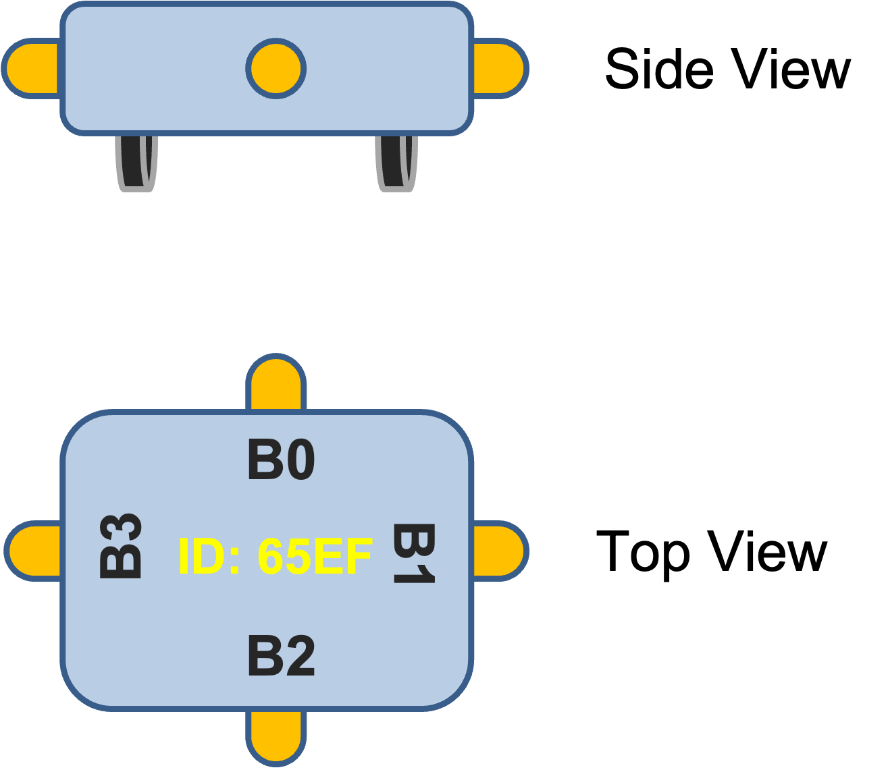
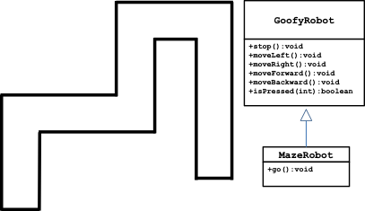
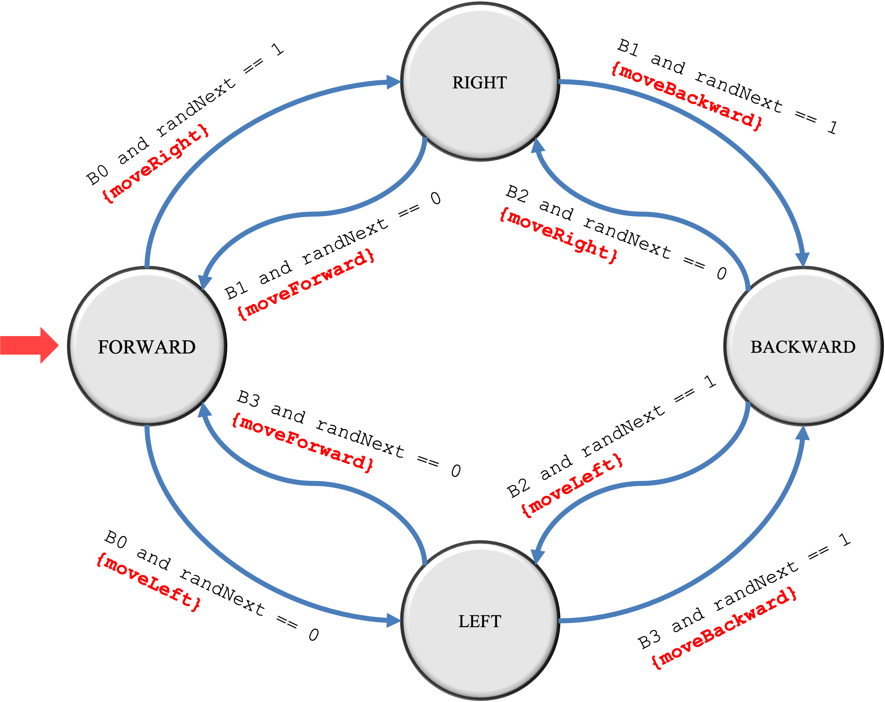

# Final Exam 1 - Coding Problem

## Introduction

Consider the robot shown in Figure 1 that has four bump sensors connected to each of its sides.

<figure style="text-align:center;padding:5px;border: 1px solid black;">

<figcaption style="color:#5555bb;">Figure 1: An omnidirectional robot with four bump sensors</figcaption>
</figure>

The robot has omnidirectional wheels, which allow the robot lateral movement while moving forward or backward. As a result of the omnidirectional wheels, our robot can move left, right, forward, and backward without turning. Bump sensor B0 is attached to the robot's forward-facing side, B1 is on the robot's right-facing side, B2 is on the robot's rear-facing side, and B3 is on its left-facing side.

Packaged with our robot is a Java framework called **goofy**. The framework consists of a class called `GoofyRobot` that has methods as shown in the <a href= "doc/index.html">documentation</a>. Creating an instance of a GoofyRobot requires an ID number that matches the ID number of the physical robot to be controlled. The robot can be manipulated using various move and stop methods. The `isPressed()` method checks if a bump sensor is activated.  

## MazeRobot

The `MazeRobot` is able to traverse a maze similar to that shown in Figure 2.

<figure style="text-align:center;padding:5px;border: 1px solid black;">

<figcaption style="color:#5555bb;">
Figure 2: Possible maze structure and UML for the MazeRobot class.</figcaption>
</figure>

The `MazeRobot` class is a subclass of the GoofyRobot class. Therefore, it inherits all the attributes and behaviors of `GoofyRobot` and implements the `go()` behavior that allows a `MazeRobot` type to traverse a maze. The behavior of the `MazeRobot` is defined in the finite state machine diagram in the next section.   

The `MazeRobot` class has a single constructor that initializes a `MazeRobot` instance with a maximum power level.

## FSM of MazeRobot

The `MazeRobot` follows a simple finite state machine, as shown in Figure 3.  *The robot starts in a forward-moving state*. When bump sensor B0 is pressed due to a wall collision, the robot randomly chooses to move left or right. If it moves to the right, it goes into the RIGHT state; otherwise, it goes into the LEFT state. While in the RIGHT state, if bump sensor B1 is pressed due to a collision with the wall, the robot chooses to move either forward or backward randomly. While in the LEFT state, if bump sensor B3 is pressed due to a collision with the wall, the robot chooses to move either forward or backward randomly. While in the BACKWARD state, if bump sensor B2 is pressed due to a collision with the wall, the robot chooses to move either forward or backward randomly.

<figure style="text-align:center;padding:5px;border: 1px solid black;">

<figcaption style="color:#5555bb;">
Figure 2: Possible maze structure and UML for the MazeRobot class.</figcaption>
</figure>

Use the enumerated type `MotionState` and the instance variable `currentState` to keep track of the state of the `MazeRobot.`   Notice that the constructor places the robot in the starting state. Also, make sure to call the appropriate move method when transitioning to a new state. For example, if the state of the MazeRobot is changing to LEFT, then make sure to also call `moveLeft()`. So, your code should look like this,

```java
currentState = MotionState.LEFT;
moveLeft();
```

if the state is changing to BACKWARD, then the code should look like this,

```java
currentState = MotionState.BACKWARD;
moveBackward();
```

## Task to be completed

Implement this finite state machine in a method called go in the `MazeRobot` class.  The `go()` method should use the following skeletal structure, already provided in the `go()` method in the `MazeRobot` class.

```java
public void go()
{
    Random randGen = new Random();

    //TODO: add your code here to put the robot in the 
    //      initial state
    while(getPowerLevel() > 0)
    {
        int randNext = randGen.nextInt(2);
        // TODO:  add your code here for the FSM
    }
}

```

## Test and Submit

A test is provided with the IntelliJ project.  Create a Gradle run configuration and use the test to complete your implementation of the `go()` method in the `MazeRobot` class.  When you are ready to submit your solution, use the CodeGrade link on the Exam page on Blackboard.

